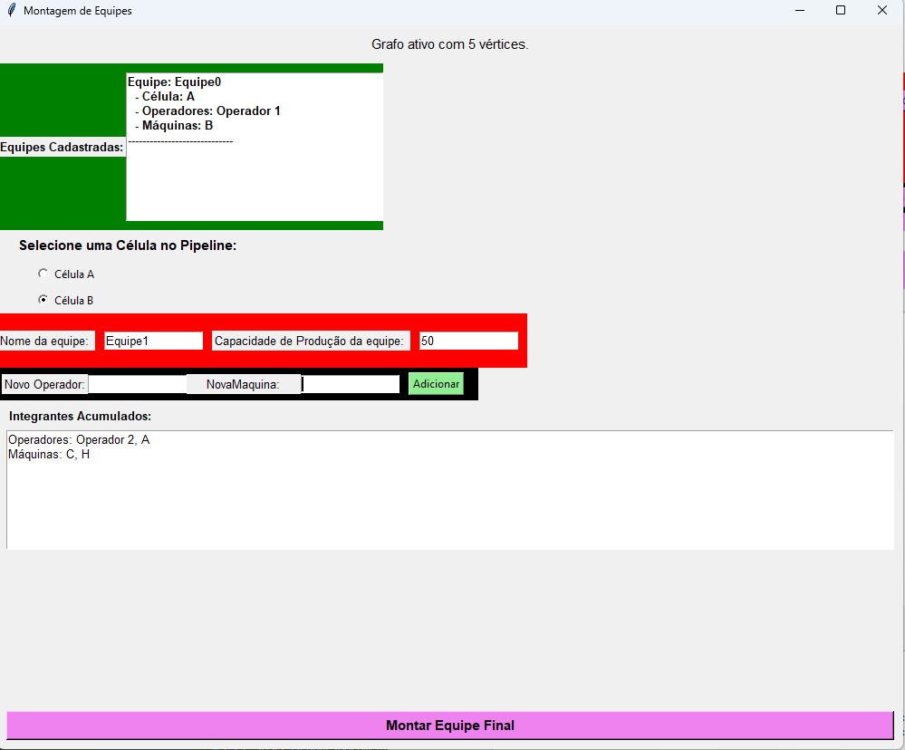
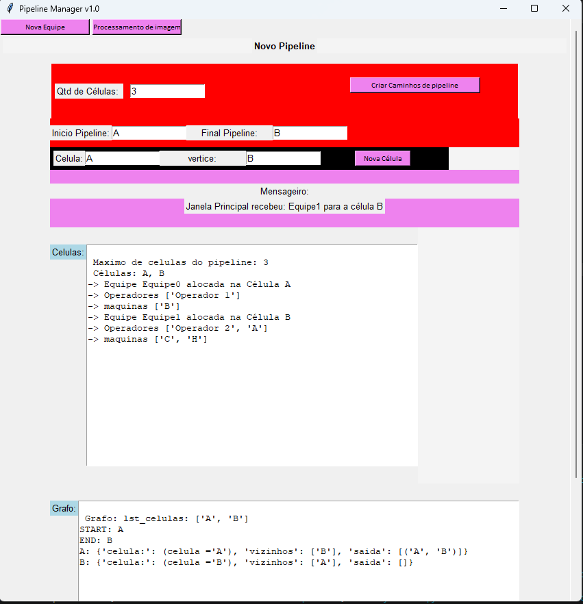
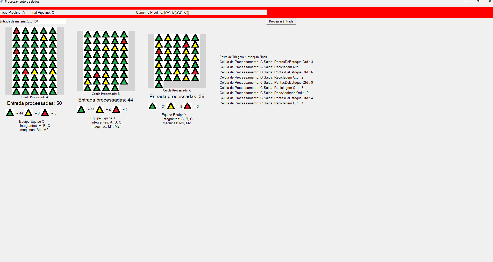

# Pipelines
Bibliotecas utilizadas:
Tkinter - interfaces graficas
PIL - Pillow - Bibioteca de imagem.
Criação de grafo de pipeline de produção(Linha de Produção)

Janela de Montar Equipes

Janela Principal

Janela de Processamento de dados

Lista de Melhorias:
Erro de lixo de memoria.
Crud completo para grafo e equipes
Gravação de informações em Arquivo json
Melhor documentação 
Melhor uso do self